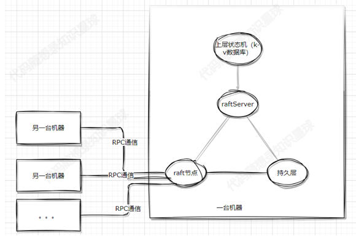
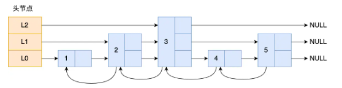
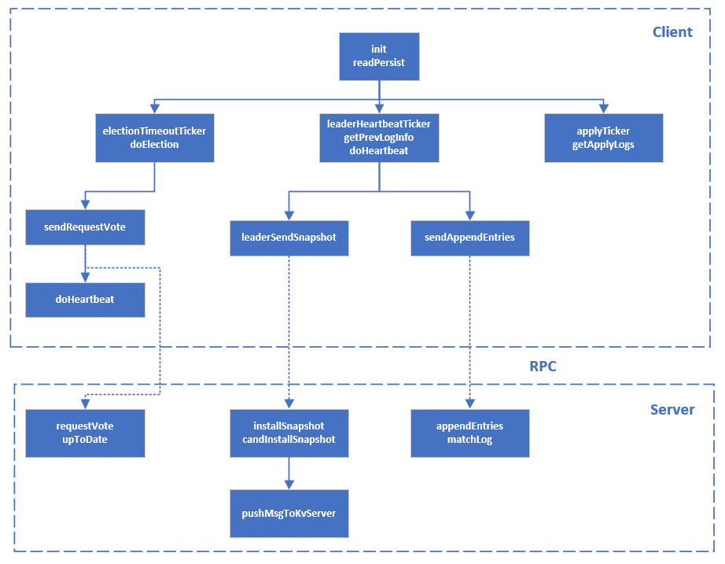

# Total

**解决的问题**
1. **一致性**： 通过Raft算法确保数据的强一致性，使得系统在正常和异常情况下都能够提供一致的数据
视图。
2. **可用性**： 通过分布式节点的复制和自动故障转移，实现高可用性，即使在部分节点故障的情况下，
系统依然能够提供服务。
3. **分区容错**： 处理网络分区的情况，确保系统在分区恢复后能够自动合并数据一致性


项目大概可以分为以下几个部分：
1. **raft节点**：raft算法实现的核心层，负责与其他机器的raft节点沟通，达到 分布式共识 的目的。
2. **raftServer**：负责raft节点与k-v数据库中间的协调服务；负责持久化k-v数据库的数据（可选）。
3. **上层状态机（k-v数据库）**：负责数据存储。
4. **持久层**：负责相关数据的落盘，对于raft节点，根据共识算法要求，必须对一些关键数据进行落盘
处理，以保证节点宕机后重启程序可以恢复关键数据；对于raftServer，可能会有一些k-v数据库的
东西需要落盘持久化。
5. **RPC通信**：在 领导者选举、日志复制、数据查询、心跳等多个Raft重要过程中提供多节点快速简单
的通信能力。

**目前规划中没有实现节点变更功能或对数据库的切片等更进阶的功能，后面考虑学习加入。**

**需要注意的是，分布式式的共识算法实现本身是一个比较严谨的过程，因为其本身的存在是为了多个服务器之间通过共识算法达成一致性的状态，从而避免单个节点不可用而导致整个集群不可用，因此在学习过程中必须要考虑不同情况下节点宕机、断网情况下的影响。**


# SkipList
kv数据库保存键值对，可以使用链表、哈希表、跳表等。

哈希表的风险：在哈希表大小固定的情况下，随着数据不断增多，那么哈希冲突的可能性也会越高。
Redis 采用了「链式哈希」来解决哈希冲突，在不扩容哈希表的前提下，将具有相同哈希值的数据串起来，形成链接起，以便这些数据在表中仍然可以被查询到。

kv数据库采用跳表实现，每个节点包括一个vector<Node<K,V>*> forward_存储每层下一个节点的指针

**查找**
跳表升序，从最高层开始遍历：
* while(cur->forward_[i] && cur->forward_[i]->getKey() < k)当下一个节点非空且小于目标值，进入下一个节点，这样cur最后就是当前层小于目标值的最大值
* cur进入当前节点的下一层继续查找，直到最底层，判断是否相等即可 

**添加**
* 类似查找，找到并记录在每一层应该插入的位置，即记录每一层该节点的前一个节点
* 如果不存在该节点，就添加，添加节点的层数采用随机算法
* 添加节点的层数算法为:产生一个[0,1]的随机数，小于0.5就继续向上插入，大于0.5就停止，产生该节点的层数。该方法保证了相邻两层之间节点数为1:2,

**删除**
* 类似添加，删除节点首先找到该节点在每一层的位置，即记录每一层该节点的前一个节点
* 对于每一层，如果前一个节点的下一个已经不是要删除的节点，停止遍历剩余的更高层；如果是要删除的节点，执行链表删除。
* 删除节点后，记得删除空的层

跳表负责存储实际的数据，需要落盘，那么就需要持久化，本项目采用boost序列化库将跳表（SkipList）中的数据持久化。

用SkipListDump类接收KV数据，并完成序列化。

**Boost序列化**

为了序列化用户定义类型的对话， serialize() 函数必须定义，它在对象序列化或从字节流中恢复是被调用。 由于 serialize () 函数既用来序列化又用来恢复数据， Boost.Serialization 除了 << 和 >> 之外还提供了 & 操作符。如果使用这个操作符，就不再需要在 serialize() 函数中区分是序列化和恢复了。

serialize () 在对象序列化或恢复时自动调用。它应从来不被明确地调用，所以应生命为私有的。 这样的话， boost::serialization::access 类必须被声明为友元，以允许 Boost.Serialization 能够访问到这个函数。

    template <typename K, typename V>
    class SkipListDump {
    public:
        friend class boost::serialization::access;
        template <class Archive>
        void serialize(Archive &ar, const unsigned int version) {
            // 当 Archive 是输出归档（如 text_oarchive）时，
            // ar & var 等价于 ar << var，表示​​将变量序列化到归档​​（如文件/内存流）。
            // 当 Archive 是输入归档（如 text_iarchive）时，
            // ar & var 等价于 ar >> var，表示​​从归档中读取数据并填充变量​​。
            ar &key_dump_vt_;
            ar &val_dump_vt_;
        }
        std::vector<K> key_dump_vt_;
        std::vector<V> val_dump_vt_;
    public:
        void insert(const Node<K, V> &node);
    };

    template <typename K, typename V>
    std::string SkipList<K, V>::dumpFile() {

        Node<K,V>* node = head_->forward_[0]; 
        SkipListDump<K,V> dumper; 
        while(node != nullptr) {  
            dumper.insert(*node);  
            node = node->forward_[0]; 
        }
        std::stringstream ss;  // 初始化字符串流对象ss，用于暂存序列化数据
        boost::archive::text_oarchive oa(ss);  // 创建text_oarchive对象oa，输出目标为ss
        oa << dumper;  // 调用Boost序列化机制：
                    // 隐式触发SkipListDump::serialize()，将key_dump_vt_和val_dump_vt_写入归档
        return ss.str(); 
# RPC
远程方法调用，实际就是给方法提供一层包装，使网络通信可以方便传递。

客户端使用rpcutil调用远程方法，实际通过stub_调用stub_->AppendEntries(&controller,request,response,nullptr);然后到rpc框架内的CallMethod，CallMethod由框架制作者提供，通过class MprpcChannel:public google::protobuf::RpcChannel重写CallMethod调用protobuf服务：CallMethod完成序列化-网络发送-（远程调用）-网络接受-反序列化结果返回给response。

Provider监听远程请求，收到请求执行回调函数OnMessage，解析请求的服务及方法，通过service->CallMethod(method,nullptr,request,response,done); 这里回调函数为SendRpcResponse。这里Provider的CallMethod根据服务和方法调用raftRpc的CallMethod，执行provider.NotifyService(this);注册重写的方法。

**RPC框架**

**Channel**
* Channel继承google::protobuf::RpcChannel,重写其CallMethod，完成完成序列化-网络发送-（远程调用）-网络接受-反序列化，结果保存到response
    ```
    virtual void RpcChannel::CallMethod(const MethodDescriptor* method,
    RpcController* controller, const Message* request,
    Message* response, Closure* done) = 0;
    ```
* 服务接口类class RaftRpcUtil通过stub_->AppendEntries调用RpcChannel的CallMethod，这个类被框架提供者重写。
    ```
    bool RaftRpcUtil::AppendEntries(raftRpcProtoc::AppendEntriesRequest *request, raftRpcProtoc::AppendEntriesResponse *response)
    {
        MprpcController controller;
        stub_->AppendEntries(&controller,request,response,nullptr);
        //->channel_->CallMethod(descriptor()->method(0),
                        controller, request, response, done);
        return !controller.Failed();
    }
    ```
**rpc框架自定义的通信协议**
header_size(4bytes) + head_str(service_name method_name args_size) + args_str
* header_size：考虑tcp粘包问题，header_size转为固定4bytes32位二进制，使用ReadVarint32i解析
* head_str：header用一个protobuffer序列化，包括服务名称、方法名称、参数长度。
* args_str：存储request,response等参数
CallMethod提取调用的服务、方法，利用send发送，发送失败会重试连接再发送，重试连接失败会直接return。接受响应后ParseFromArray反序列化，把结果保存到response。

**Provider**
NotifyService(google::protobuf::Service \*service)可接受继承自raftRpcProtoc::raftRpc的子类对象，完成对对这些重写函数的动态注册​​，如raft中的AppendEntries等，获取该类有哪些rpc方法，保存到哈希表中，把str映射到google::protobuf::MethodDescriptor\*，有请求发来时就找到对应方法执行。

Run实现对rpc客户端的监听，收到rpc请求就使用回调函数OnMessage处理，OnMessage完成反序列化，提取出相应方法，从哈希表中找到对应方法，注册回调函数SendRpcResponse（SendRpcResponse完成序列化和响应发送），然后执行CallMethod，执行真正的方法。
```
//获取服务和方法 
google::protobuf::Service *service = it->second.m_service;      
const google::protobuf::MethodDescriptor* method = mit->second; 
//生成response和request参数,service->GetRequestPrototype()得到method所需的request类型，Login->LoginRequest
google::protobuf::Message *request = service->GetRequestPrototype(method).New();
if(!request->ParseFromString(args_str)){
    //解析请求到request
    return ;
}
google::protobuf::Message *response = service->GetResponsePrototype(method).New();
//创建一个closure派生类对象，不同参数对应不同派生类，派生类中重写run调用method_，即SendRpcResponse
google::protobuf::Closure* done = google::protobuf::NewCallback<RpcProvider,const muduo::net::TcpConnectionPtr&,google::protobuf::Message*>
                                        (this, &RpcProvider::SendRpcResponse, conn, response);
service->CallMethod(method,nullptr,request,response,done); 
```
**这里的CallMethod是重载raftRpc的CallMethod，执行对应的方法**
```
void raftRpc::CallMethod(const ::PROTOBUF_NAMESPACE_ID::MethodDescriptor* method,
    ::PROTOBUF_NAMESPACE_ID::RpcController* controller,
    const ::PROTOBUF_NAMESPACE_ID::Message* request,
    ::PROTOBUF_NAMESPACE_ID::Message* response,
    ::google::protobuf::Closure* done) {
  GOOGLE_DCHECK_EQ(method->service(), file_level_service_descriptors_raftrpc_2eproto[0]);
  switch(method->index()) {
    case 0:
      AppendEntries(controller,
             ::PROTOBUF_NAMESPACE_ID::internal::DownCast<const ::raftRpcProtoc::AppendEntriesRequest*>(
                 request),
             ::PROTOBUF_NAMESPACE_ID::internal::DownCast<::raftRpcProtoc::AppendEntriesResponse*>(
                 response),
             done);
      break;
    case 1:
      RequestVote(controller,
             ::PROTOBUF_NAMESPACE_ID::internal::DownCast<const ::raftRpcProtoc::RequestVoteRequest*>(
                 request),
             ::PROTOBUF_NAMESPACE_ID::internal::DownCast<::raftRpcProtoc::RequestVoteResponse*>(
                 response),
             done);
      break;
    case 2:
      InstallSnapshot(controller,
             ::PROTOBUF_NAMESPACE_ID::internal::DownCast<const ::raftRpcProtoc::InstallSnapshotRequest*>(
                 request),
             ::PROTOBUF_NAMESPACE_ID::internal::DownCast<::raftRpcProtoc::InstallSnapshotResponse*>(
                 response),
             done);
      break;
    default:
      GOOGLE_LOG(FATAL) << "Bad method index; this should never happen.";
      break;
  }
}
```
# Protobuf
```
syntax = "proto3";
package raftRpcProtoc;
option cc_generic_services = true;
message LogEntry{
    bytes Command = 1;
    int32 LogTerm=2;
    int32 LogIndex=3;
}
message AppendEntriesRequest{
    int32 Term=1;
    int32 LeaderId=2;
    int32 PrevLogIndex=3;
    int32 PrevLogTerm=4;
    repeated LogEntry Entries=5;
    int32 LeaderCommit=6;
}
message AppendEntriesResponse{
    int32 Term=1;
    bool Success=2;
    int32 UpdateNextIndex = 3;//快速调整leader对应的nextIndex
}
service raftRpc{
    rpc AppendEntries(AppendEntriesRequest) returns(AppendEntriesResponse);
}
```

# Raft
Raft 算法被我们分成领导人选举，日志复制，安全性和成员变更几个部分。领导人选举、日志复制采用rpc实现，raft作为服务提供方，继承raftRpcProtoc::raftRpc，重写实际的方法.raft作为服务调用方，存储了其他raft节点的对外借口std::vector<std::shared_ptr<RaftRpcUtil>> peers_，调用其远程方法即可完成消息传递。
`bool ok = peers_[server]->RequestVote(request.get(),response.get());`


raftutil通过raftRpc_Stub的stub_即可调用远程方法。
```
 void AppendEntries(google::protobuf::RpcController *controller, const raftRpcProtoc::AppendEntriesRequest *request,
    raftRpcProtoc::AppendEntriesResponse *response, ::google::protobuf::Closure *done) override;
 void InstallSnapshot(google::protobuf::RpcController *controller,const raftRpcProtoc::InstallSnapshotRequest *request,
    raftRpcProtoc::InstallSnapshotResponse *response, ::google::protobuf::Closure *done) override;
 void RequestVote(google::protobuf::RpcController *controller, const raftRpcProtoc::RequestVoteRequest *request,
    raftRpcProtoc::RequestVoteResponse *response, google::protobuf::Closure *done) override;
```

**raft节点基本状态：**
|状态|含义|
|---|---|
|currentTerm|服务器已知最新的任期（在服务器首次启动时初始化为0，单调递增）|
|votedFor|当前任期内收到选票的 candidateId，如果没有投给任何候选人 则为空|
|log[]|日志条目；每个条目包含了用于状态机的命令，以及领导人接收到该条目时的任期（初始索引为1）|
|commitIndex|已知已提交的最高的日志条目的索引（初始值为0，单调递增）|
|lastApplied|已经被应用到状态机的最高的日志条目的索引（初始值为0，单调递增）|

**Leader的独有状态：**
|状态|含义|
|---|---|
|nextIndex[]|对于每一台服务器，发送到该服务器的下一个日志条目的索引（初始值为领导人最后的日志条目的索引+1）
|matchIndex[]|对于每一台服务器，已知的已经复制到该服务器的最高日志条目的索引（初始值为0，单调递增）|

Raft使用三个线程运行三个计时器，完成定时选举、日志复制和日志提交。
**选举、日志复制:**计时器睡眠指定时间，检查上次心跳时间是否被重置，来判断是否需要执行任务。逻辑如下：
```
while not leader{
    usleep
}
{
    lock()
    wakeTime=now()
    suitableSleepTime=HeartbeatTimeout-（wakeTime-last_rest_heartbeat_time_）
}
if(suitableSleepTime>0){
    usleep(suitableSleepTime)
}
if(last_rest_heartbeat_time_ > wakeTime){
    continue;
}
doElection() or doHeartbeat()
```
**当收到日志、发起选举请求、收到快照、leader发现自己落后、收到选举请求时，重置上次选举时间，触发选举。**
`last_rest_heartbeat_time_=now()`

**日志提交**：睡眠固定时间，唤醒将可以已提交的日志，提交到kvserver,通过push到apply_chan_完成。



## 领导者选举
|参数|含义|
|---|---|
|term|候选人的任期号|
|candidateId|请求选票的候选人的 ID|
|lastLogIndex|候选人的最后日志条目的索引值|
|lastLogTerm|候选人最后日志条目的任期号|

|参数|含义|
|---|---|
|term|当前任期号，以便于候选人去更新自己的任期号|
|voteGranted|候选人赢得了此张选票时为真|

**发起者、客户端 doElection()**
定时器触发选举，加锁，如果是Leader，continue。
更新节点基本状态，持久化，重置超时时间，向每个节点发起投票，每个节点开一个线程sendRequestVote。

sendRequestVote中收到结果后，对每个返回值进行判断：
**term**
1. term>current_term
    改变基本状态，设置为Follower
2. term<current_term
   return

**voteGranted**
1. false
   return
2. true
    判断已经有几个人投给自己，超过半数：
    * 清空票数
    * 状态变为Leader
    * 设置next_index[]为last_log_index+1,从最新的开始发，follower如果已经有，告知该发哪个。这里逐个选期判断，每次设置为选期的第一个。
    * 设置match_index[]为0,从最新的开始匹配
    * doHeartbeat()

**处理者、服务器端 requestVote()**
基本逻辑就是如果term < currentTerm返回 false；如果 votedFor 为空或者为 candidateId，并且候选人的日志至少和自己一样新，那么就投票给他。

requestVote依次判断请求值
**term**
1. term<current_term
   候选者落后，写入response，return
2. term>current_term
   修改自己的基本状态为follower

**lastLogIndex&lastLogTerm**
upToDate判断以下条件成立
term > last_term || (term == last_term && index >= last_index)
否则不给他投票，return
**candidateId**
如果本节点已经投给其他人，return
否则，投给该节点，重置选举计时器。

## 日志复制
|参数|含义|
|---|---|
|term|领导人的任期|
|leaderId|领导人 ID 因此跟随者可以对客户端进行重定向（译者注：跟随者根据领导人 ID 把客户端的请求重定向到领导人，比如有时客户端把请求发给了跟随者而不是领导人）|
|prevLogIndex|紧邻新日志条目之前的那个日志条目的索引|
|prevLogTerm|紧邻新日志条目之前的那个日志条目的任期|
|entries[]|需要被保存的日志条目（被当做心跳使用时，则日志条目内容为空；为了提高效率可能一次性发送多个）|
|leaderCommit|领导人的已知已提交的最高的日志条目的索引|

|返回值|含义|
|---|---|
|term|当前任期，对于领导人而言 它会更新自己的任期|
|success|如果跟随者所含有的条目和 prevLogIndex 以及 prevLogTerm 匹配上了，则为 true|

leader通过心跳同时完成日志同步和对其他节点的压制，follower节点收到日志后，会重置超时计时器，避免发起选举。
**日志匹配特性（Log Matching Property）：**
**如果在不同的日志中的两个条目拥有相同的索引和任期号，那么他们存储了相同的指令。**
**如果在不同的日志中的两个条目拥有相同的索引和任期号，那么他们之前的所有日志条目也全部相同。**

**注意：**raft为了避免出现一致性问题，要求 leader 绝不会提交过去的 term 的 entry （即使该entry 已经被复制到了多数节点上）。leader永远只提交当前 term 的 entry， 过去的 entry 只会随着当前的 entry 被一并提交。

**发起者、客户端 doHeartbeat()**
定时器触发日志复制，加锁，Leader才能发送日志。
给每个peer复制日志：
1. 首先判断是否发送快照，如果next_index<last_snapshot_include_index，开一个线程leaderSendSnapshot，continue
2. 构造要发送的日志，判断从现有日志哪里开始发，如果上一次发送的日志在快照里，就把所有日志发送，否则从上一次发送的日志后面开始发
3. 开一个线程，sendAppendEntries
4. 更新心跳计时器last_rest_heartbeat_time_=now()

**处理者、服务器端**
appendEntries依次判断请求值
**term**
1. term<current_term
    false，告知leader需要更新,return
2. term>current_term
    把基本状态设置为follower

**prevlogindex**
1. prevlogindex>last_log_index
   发来的日志比最新的还新，告诉leader发本节点的下一个日志，return
2. prevlogindex<last_snapshot_index_
   发来的日志比快照里的晚，告诉leader发快照的下一个日志

**prevlogterm**
1. prevlogterm == getLogTermFromLogIndex(prevlogindex)
   前一个日志匹配，可以拷贝日志。
   遍历发来的日志：
   * 如果log比最新的log的index大，说明这个h日子的位置上没有log，直接添加。
   * 否则，这个log的index位置上有log,比较日志的term,不相等就不匹配，更新为发来的日志
2. prevlogterm != getLogTermFromLogIndex(prevlogindex)
    向前寻找，找到前一个日志不匹配的第一个位置，告诉leader下一个重发这个日志

**leadercommit**
1. leadercommit>commit_index
   需要增加可以提供的日志，但最多到本节点拥有的最新节点commit_index_=std::min(request->leadercommit(),getLastLogIndex());

## 日志快照
|参数|含义|
|---|---|
|term|领导人的任期号|
|leaderId|领导人的 ID，以便于跟随者重定向请求|
|lastIncludedIndex|快照中包含的最后日志条目的索引值|
|lastIncludedTerm|快照中包含的最后日志条目的任期号|
|data[]|从偏移量开始的快照分块的原始字节|

|返回值|含义|
|---|---|
|term|当前任期号（currentTerm），便于领导人更新自己|

上层kvserver制作日志的快照，即状态机的持久化内容。如果日志过多就制作快照，增加last_snapshot_include_index_。快照的同步由raft节点负责。快照是持久化的，存在磁盘中，由perisister从文件中读写。

**发起者、客户端**
心跳doHeartbeat时，如果该节点的next_index[i]< last_snapshot_include_index,即leader收到了kvserver新的快照，向该节点发送快照。用persister->readSnapshot从文件读取快照，发起rpc请求。

判断返回值：
1. term>current_term
   本leader已经落后，变为follower,发起选举，return
2. term<=current_term
   更新match_index[i]为快照最后一个日志
   更新next_index[i]为更新match_index[i]+1

**处理者、服务器端**
1. term<current_term
   返回current_term，return
2. term>current_term
   更新节点状态
3. 重置选举超时计时器
3. request的快照比本节点快照旧，return
4. 删掉本节点的日志中与request的快照重合的部分，
   * 如果本节点日志比快照多，只留下快照后面的日志
   * 如果本节点日志比快照少，全部删掉
5. 更新commit_index和last_appiled为本节点值和快照最后的日志的最大值
6. 把快照取出制作ApplyMsg，开一个线程提交到kvserver，即push到apply_chan
7. 使用persister->save,把节点状态和新的快照持久化

**kvserver将状态机快照传递至raft层**
**snapshot(int index,std::string snapshot)**
1. index为新的last_snapshot_include_index，必须比提交的日志旧，比旧的快照新。
2. 把快照包括的日志去掉，更新commit_index和last_appiled。
3. 持久化日志状态和快照

## 提交
applyTicker定时唤醒执行，利用getApplyLogs获取已经提交的日志，while(last_appiled_< commit_index_)制作ApplyMsgs,然后逐个提交到apply_chan_，传递到kvserver层的kv状态机（跳表）。


## 持久化
持久化**节点状态和状态机快照**，分别存放在raft_state_out_stream_和snapshot_out_stream_，节点状态包括基本状态和日志，
**Raft中的持久化相关方法**
persisit：序列化节点状态，使用persister持久化节点状态。
persistData()：序列化节点状态。
readPersist：反序列化节点状态，加载节点状态。

需要先序列化再持久化写入文件。
* 基本状态只需要boost序列化。
* 日志要先protobuf序列化，再boost序列化。
* 快照使用状态机的持久化方法，就是跳表的持久化方法：boost
* 快照是持久化保存的，每次利用persister读写

**持久化基本方法：**
**​​std::ofstream 方式​**
    专用于文件输出的流类，仅支持写入操作
    save():保存节点状态和日志快照，其他节点或kvserver发来快照时使用。
    saveRaftState():保存节点状态。

**​​std::fstream 方式​**
    通用文件流类，支持读写操作
    readRaftState():raft初始化使用。
    readSnapshot():向其他节点发生快照时使用，快照文件较大，因此需要先关闭snapshot_out_stream_，**避免写冲突，强制刷新缓冲区，保证读取到最新数据，长期保持大文件输出流打开会​​占用文件句柄和内存**

**持久化的时机：每当节点基本状态或快照改变时，持久化节点状态或快照**

## KVServer

## 安全性

# Boost序列化与Protobuf序列化
Boost序列化库支持多种数据格式，包括二进制、文本和XML。二进制格式（Binary format）提供高效的数据处理速度，适合性能敏感的应用。文本格式（Text format）和XML格式（XML format）则提供了更好的可读性和可编辑性，便于调试和数据交换。

Protobuf（Protocol Buffers），由Google开发，是一个灵活、高效的结构化数据存储格式。它主要使用一种类似于接口描述语言（Interface Description Language，IDL）的语法来定义数据结构。Protobuf编译器可以根据这些定义生成各种编程语言的源代码，从而实现跨语言、跨平台的数据序列化和反序列化。

|特性|Boost序列化|Protobuf序列化|
|------|------|------|
|数据处理|高灵活性，适应复杂结构|高效率，适合大规模数据|
|内存使用|较高	|较低|
|处理时间|可能较长|相对较短|
|应用场景|复杂数据结构|大量数据处理|
